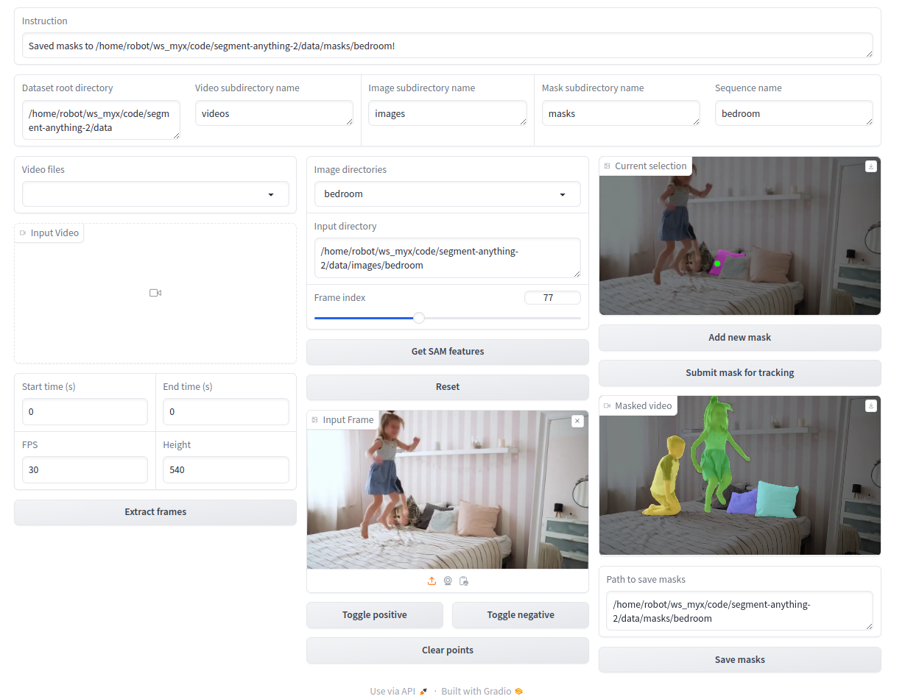

# GUI for SAM2
A GUI tool for SAM2 video segmentation.

## Installation
You should install [SAM2](https://github.com/facebookresearch/segment-anything-2?tab=readme-ov-file) first.
```
pip install -r requirements.txt
```

## Processing Custom Data

We highly encourage users to structure their data directories in the following way:
```
- data_root
    '- videos
    |   - seq1.mp4
    |   - seq2.mp4
[and/or]
    '- images
    |   - seq1
    |   - seq2
    '- ...
```
## Usage
```
python mask_app.py --root_dir [data_root]
```


## Acknowledge
The app is modified based on [shape-of-motion](https://github.com/vye16/shape-of-motion/?tab=readme-ov-file).